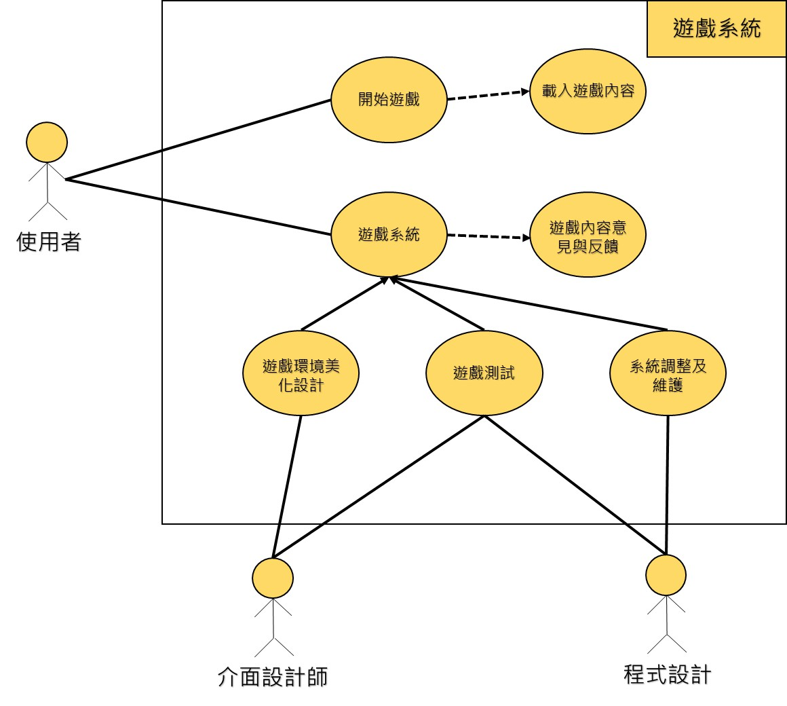
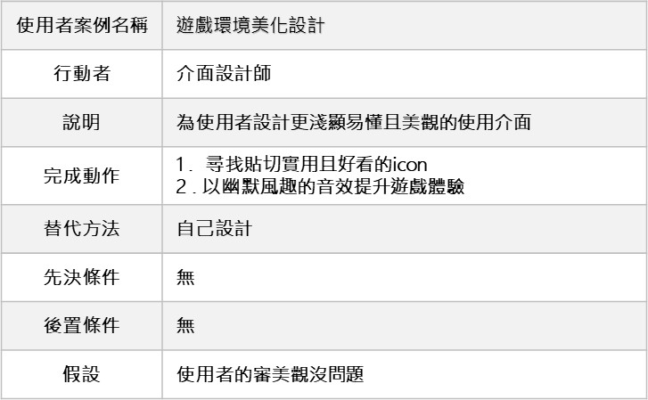
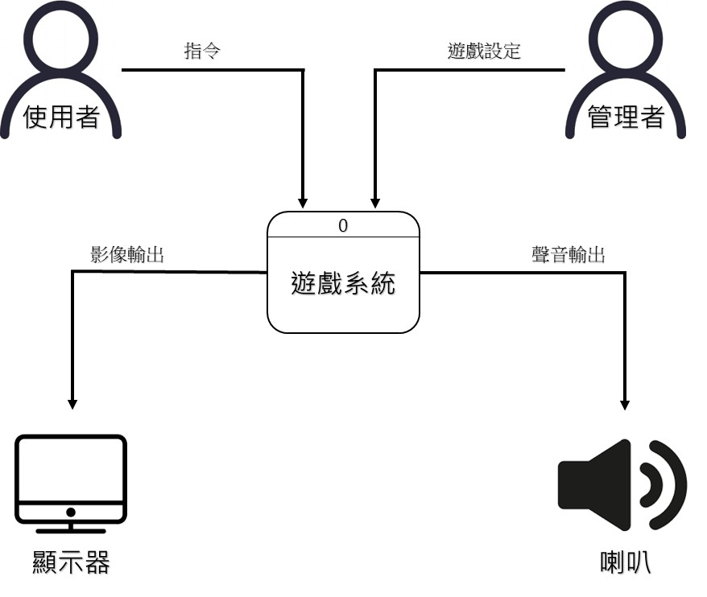

# 2020project
## 專題名稱: 防範三寶 從遊戲做起

## 成員:

| 職位| 學號 | 姓名 | 工作分配 |
|:-------| :--------: |-------: |--------: |
| 組長 | C107118228 | 邱柏勳 | 程式設計 |
| 組員 | C107118245 | 廖浩翔 | 程式設計 |
| 組員 | C107118241 | 林聖儒 | 程式美觀 |
| 組員 | C107118229 | 呂威蓉 | 程式設計 |
| 組員 | C107118237 | 劉俊廷 | 程式設計 |

## 功能性需求:
1.遊戲規則簡單明瞭
2.豎立交通安全觀念

## 非功能需求:
1.適合全家大小遊玩
2.可靠性:遊戲規則遵循交通法規
3.遊戲界面簡易，好操作
4.系統管理者方便管理

## 需求分析:
1.遊戲流暢度高
2.遊玩過程有清楚明確的交通告示
3.可以駕駛不同車種

## FDD(功能分解圖):

## 甘特圖:

## PERT/CPM圖:

## 使用案例圖:

## 使用案例說明:

## DFD系統環境圖:

## DFD圖0:

