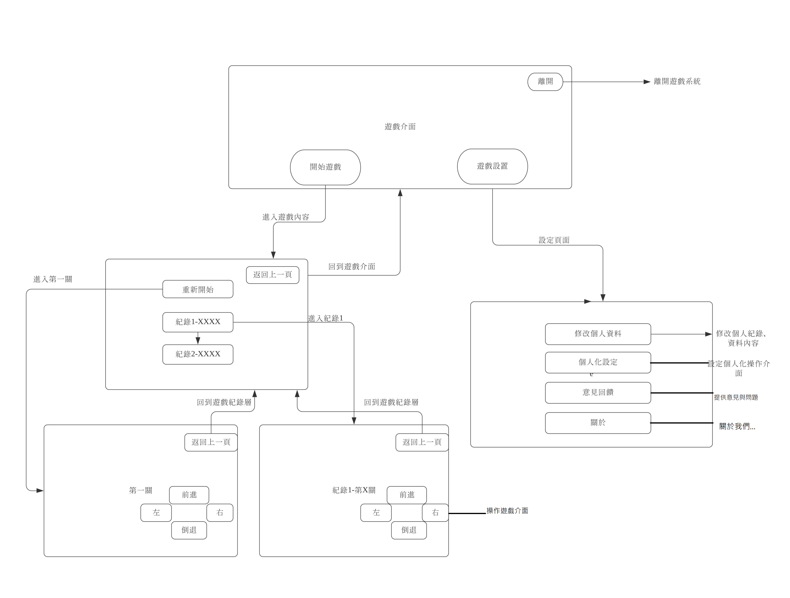

# 2020project
## 專題名稱: 防範三寶 從遊戲做起

## PPT:
https://drive.google.com/file/d/1aH4C-mmEYIF8mkoTERVRhlu_SqZlYaAS/view?usp=sharing

## 成員:

| 職位| 學號 | 姓名 | 工作分配 |
|:-------| :--------: |-------: |--------: |
| 組長 | C107118228 | 邱柏勳 | 程式設計 |
| 組員 | C107118245 | 廖浩翔 | 程式設計 |
| 組員 | C107118241 | 林聖儒 | 美觀 |
| 組員 | C107118229 | 呂威蓉 | 程式設計 |
| 組員 | C107118237 | 劉俊廷 | 程式設計 |

## 創意發想:
台灣車禍頻傳，小至擦撞，大至死傷，每天車禍事件層出不窮。
尤其台灣道路規則多，雖然道路上都有時速限制，車禍發生率卻屢創新高。
而網路上整理出駕駛常犯的7大開車習慣，不打方向燈、緊貼前車、開車滑手機、亂閃燈光、超速、亂入車陣和突然開車門。
因上述這幾個壞習慣，我們認為要減少交通事故究應該要從小開始學習「防衛性駕駛」 的概念。

## 專案內容:
藉由這款遊戲讓小孩以至老年人都能學習到政府所制定的交通規則。
並從中學會「防衛性駕駛」 ，時時提高警覺，防範「三寶」可能造成的道路傷害,就能減少全台灣的車禍發生率。

## 功能性需求:
1.遊戲規則簡單明瞭
2.豎立交通安全觀念

## 非功能需求:
1.適合全家大小遊玩
2.可靠性:遊戲規則遵循交通法規
3.遊戲界面簡易，好操作
4.系統管理者方便管理

## 需求分析:
1.遊戲流暢度高
2.遊玩過程有清楚明確的交通告示
3.可以駕駛不同車種

## FDD(功能分解圖):

## 甘特圖:

## PERT/CPM圖:

## 使用案例圖:

## 使用案例說明:

## DFD系統環境圖:

## DFD圖0:

## UML類別圖:

## 循序圖與活動圖:

##分鏡圖

## 輸入欄位:
| 欄位名稱 | 資料型態 | 驗證規則 |
|:------- |:-------- |:-------- |
| 名稱 | String | 必須為字串|

## 按鈕名稱:
| 按鈕名稱 | 功能 |
|:------- |:-------- | 
| 前 | 車子前進 |
| 後 | 車子後退 |
| 左 | 車子左轉 | 
| 右 | 車子右轉 | 

## 實體關係圖:

